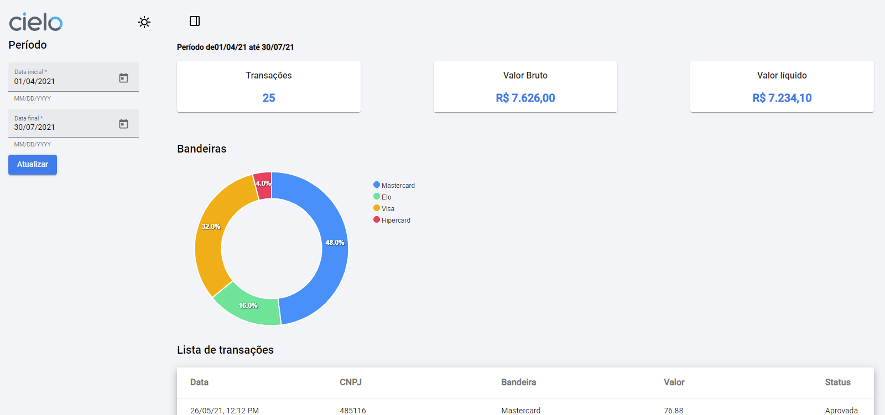

# Bootcamp Ada/Cielo Dev 

### Tecnologias utilizadas 
- Angular@14.3.0
- Angular material@14.2.7
- ng-apexcharts@1.7.4

### Rodar projeto 

Para rodar o projeto em localhost, segir os passos abaixo:
### Passo 1 - API mock
Abrir um terminal e digitar os comandos:
1. `cd projeto-web-front-end-angular`
2. `npx json-server --watch ./api-mock/Desafio_FrontEnd_v2.0.json`

### Passo 2 - Front-end
Abrir um segundo terminal e digitar os comandos:
1. `npm install`
2. `ng serve`

### Passo 3 
Abrir o browser com esse link http://localhost:4200/home

### Interfaces

| Dashboard |
|:-------------:|
|

### Referências:

- [Angular CLI Overview and Command Reference](https://angular.io/cli)
- https://www.npmjs.com/package/json-server

